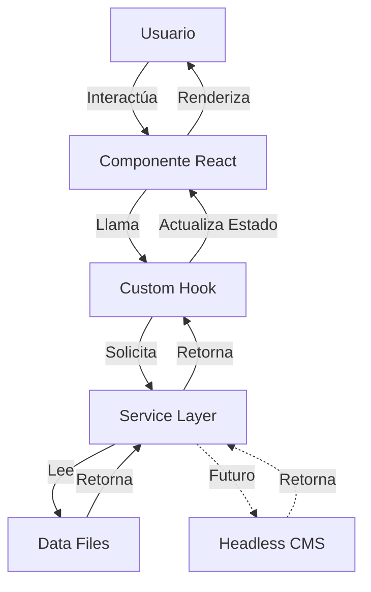

# 📊 Análisis Completo del Proyecto MyAppGlass

**Fecha de Análisis:** 2026-02-08  
**Proyecto:** GYA Glass & Aluminum - Aplicación Web Corporativa  
**Estado del Servidor:** ✅ En ejecución (`pnpm run dev` - 3m22s)

---

## 📋 Resumen Ejecutivo

MyAppGlass es una aplicación web moderna y bien estructurada para GYA Glass & Aluminum S.A.C., construida con React 18, Vite y Chakra UI. El proyecto demuestra buenas prácticas de arquitectura de software con una separación clara de responsabilidades, componentes modulares y optimizaciones de rendimiento.

### Estado General
- ✅ **Arquitectura:** Sólida y escalable
- ⚠️ **Calidad de Código:** 12 advertencias de linting (no críticas)
- ✅ **Documentación:** Excelente (JSDoc completo)
- ✅ **Rendimiento:** Optimizado con code splitting e infinite scroll
- ✅ **SEO:** Implementado con React Helmet Async

---

## 🏗️ Arquitectura del Proyecto

### Stack Tecnológico

#### Core
- **Framework:** React 18.3.1
- **Build Tool:** Vite 5.4.21
- **Lenguaje:** JavaScript (JSX)
- **Gestor de Paquetes:** pnpm

#### UI & Styling
- **UI Framework:** Chakra UI 2.10.9
- **Animaciones:** Framer Motion 11.18.2
- **Iconos:** 
  - @chakra-ui/icons 2.2.4
  - @heroicons/react 2.2.0
  - react-icons 5.5.0
- **Fuentes:**
  - @fontsource/lora 5.2.8
  - @fontsource/open-sans 5.2.7
  - @fontsource/raleway 5.2.8

#### Routing & SEO
- **Router:** React Router DOM 6.30.3
- **SEO:** React Helmet Async 2.0.5

#### Backend & Hosting
- **Backend:** Firebase 12.9.0
- **Funciones Serverless:** Firebase Functions
- **Hosting:** Firebase Hosting

#### Desarrollo
- **Linter:** ESLint 8.57.1
- **Optimización de Imágenes:** vite-plugin-image-optimizer 2.0.3
- **Validación de Props:** prop-types 15.8.1

---

## 📂 Estructura de Directorios

```
MyAppGlass/
├── .git/                          # Control de versiones
├── .firebaserc                    # Configuración de Firebase
├── firebase.json                  # Configuración de hosting/functions
├── firestore.rules                # Reglas de seguridad Firestore
├── functions/                     # Firebase Cloud Functions
│   ├── emailSender.js            # Servicio de envío de emails
│   ├── index.js                  # Punto de entrada
│   └── package.json              # Dependencias de functions
├── public/                        # Archivos estáticos
├── src/
│   ├── api/                      # Configuración de APIs externas
│   ├── assets/                   # Imágenes, logos, recursos
│   ├── components/               # Componentes React (62 archivos .jsx)
│   │   ├── common/              # Componentes reutilizables
│   │   │   ├── Gallery.jsx
│   │   │   ├── DataLoader.jsx
│   │   │   ├── ScrollReveal.jsx
│   │   │   └── ...
│   │   ├── home/                # Componentes de la página principal
│   │   ├── projects/            # Componentes de proyectos
│   │   └── services/            # Componentes de servicios
│   ├── config/                  # Configuración de la app
│   │   ├── theme.js            # Tema de Chakra UI
│   │   └── firebase.js         # Configuración Firebase
│   ├── data/                    # Datos estáticos (20 archivos)
│   │   ├── clients.js
│   │   ├── features.js
│   │   ├── projects.js
│   │   ├── services.js
│   │   └── gallery/            # 13 archivos de galerías
│   ├── docs/                    # Documentación (34 archivos)
│   ├── hooks/                   # Custom Hooks (5 archivos)
│   │   ├── useGallery.js
│   │   ├── useIntersectionObserver.js
│   │   ├── useIsMobile.js
│   │   ├── useProjectModal.js
│   │   └── useReclamoForm.js
│   ├── layout/                  # Componentes de layout
│   │   ├── Layout.jsx
│   │   ├── Navbar.jsx
│   │   ├── Footer.jsx
│   │   └── floating-whatsapp.jsx
│   ├── pages/                   # Vistas principales (8 páginas)
│   │   ├── HomePage.jsx
│   │   ├── ProjectPage.jsx
│   │   ├── ServicePage.jsx
│   │   ├── CompanyPoliciesPage.jsx
│   │   ├── BankAccountsPage.jsx
│   │   └── ...
│   ├── routes/                  # Configuración de rutas
│   │   ├── index.jsx
│   │   └── serviceRoutes.jsx
│   ├── services/                # Capa de abstracción de datos
│   │   ├── clientService.js
│   │   ├── featureService.js
│   │   ├── projectService.js
│   │   └── serviceService.js
│   ├── styles/                  # Estilos globales
│   ├── utils/                   # Utilidades
│   ├── App.jsx                  # Componente raíz
│   └── main.jsx                 # Punto de entrada
├── eslint.config.js             # Configuración ESLint
├── vite.config.js               # Configuración Vite
├── package.json                 # Dependencias del proyecto
└── README.md                    # Documentación principal
```

---

## 🎯 Patrones de Arquitectura

### 1. **Arquitectura por Capas**

El proyecto implementa una arquitectura limpia con separación de responsabilidades:

```
┌─────────────────────────────────────┐
│   Capa de Presentación (UI)        │
│   - Components (React)              │
│   - Pages (Vistas completas)        │
└─────────────────┬───────────────────┘
                  │
┌─────────────────▼───────────────────┐
│   Capa de Lógica de Negocio        │
│   - Custom Hooks                    │
│   - Services (Abstracción de datos) │
└─────────────────┬───────────────────┘
                  │
┌─────────────────▼───────────────────┐
│   Capa de Datos                     │
│   - Static Data (src/data)          │
│   - Firebase (futuro CMS)           │
└─────────────────────────────────────┘
```

### 2. **Component-Driven Development**

- **Atomic Design:** Componentes divididos en niveles de complejidad
- **Componentes Comunes:** Reutilizables en toda la aplicación
- **Feature-Based:** Agrupados por funcionalidad (home, projects, services)

### 3. **Service Layer Pattern**

Los componentes NO acceden directamente a los datos. Ejemplo:

```javascript
// ❌ ANTES (acoplado)
import projectsData from '../data/projects.js';

// ✅ AHORA (desacoplado)
import { getProjects } from '../services/projectService.js';
const projects = await getProjects();
```

**Beneficios:**
- Fácil migración a un CMS sin cambiar componentes
- Testing más sencillo
- Separación de responsabilidades

---

## 🎨 Sistema de Diseño

### Tema Centralizado (Chakra UI)

Archivo: [`src/config/theme.js`](file:///c:/Users/LJCR/Documents/GitHub/MyAppGlass/src/config/theme.js)

#### Tipografía
```javascript
fonts: {
  heading: "Lora, serif",
  body: "Lora, serif"
}
```

#### Paleta de Colores
- **Primary:** Escala de rojos (#f44336 base)
- **Text Secondary:** #6c757d
- **Franja Backgrounds:** Transparencias adaptativas

#### Modos de Color
- **Inicial:** Dark mode
- **Sistema:** Deshabilitado (preferencia manual)

#### Variantes de Componentes
- **Card Glass:** Efecto glassmorphism con `backdrop-filter: blur(10px)`

---

## ⚡ Optimizaciones de Rendimiento

### 1. **Code Splitting**

```javascript
// routes/index.jsx
const HomePage = lazy(() => import("@/pages/HomePage"));
const ServicePage = lazy(() => import("@/pages/ServicePage"));
```

**Resultado:** Carga bajo demanda de páginas

### 2. **Chunking Manual (Vite)**

```javascript
// vite.config.js
manualChunks(id) {
  if (id.includes("firebase")) return "firebase";
  if (id.includes("@chakra-ui")) return "chakra-ui";
  if (id.includes("framer-motion")) return "framer-motion";
  if (id.includes("node_modules")) return "vendor";
}
```

**Beneficios:**
- Cacheo eficiente de dependencias
- Reducción de bundle principal

### 3. **Optimización de Imágenes**

```javascript
// vite.config.js
ViteImageOptimizer({
  jpg: { quality: 50 },
  png: { quality: 50 },
  webp: { quality: 50 },
  sharpOptions: { rotate: true } // Auto-rotación EXIF
})
```

### 4. **Infinite Scroll**

Implementado en:
- Listado de proyectos
- Listado de servicios
- Listado de clientes

**Hook:** `useIntersectionObserver.js`

### 5. **Suspense & Skeletons**

```javascript
<Suspense fallback={<LoadingFallback />}>
  <Outlet />
</Suspense>
```

Skeletons específicos:
- `ProjectListSkeleton`
- `ServiceListSkeleton`
- `ClientListSkeleton`
- `FeatureListSkeleton`

---

## 🔧 Configuración de Herramientas

### Vite

**Características clave:**
- Puerto: 5173
- Auto-apertura del navegador
- Target: ES2015 (compatibilidad móviles antiguos)
- Alias: `@` → `./src`

### ESLint

**Reglas personalizadas:**
- `react/prop-types`: OFF (usa prop-types manualmente)
- `react/react-in-jsx-scope`: OFF (React 18)
- `no-unused-vars`: WARN (permite `_` y `React`)
- Configuración separada para `functions/` (Node.js)

---

## 🐛 Análisis de Calidad de Código

### Estado del Linting

**Resultado:** ⚠️ 12 advertencias (0 errores)

#### Desglose de Advertencias

| Archivo | Problema | Cantidad |
|---------|----------|----------|
| `Franja.jsx` | Variable `bgColor` no usada | 1 |
| `ClientsSection.jsx` | Imports no usados (`useMemo`, `Box`, `Spinner`, `useIntersectionObserver`) | 4 |
| `ServiceListSkeleton.jsx` | Variable `cardBorderColor` no usada | 1 |
| `SpecItem.jsx` | Imports y variables no usados (`Box`, `Icon`, `icon`, `iconBg`) | 4 |
| `palmer.js` | Constantes no usadas (`PALMER03`, `PALMER07`) | 2 |

**Impacto:** 🟡 Bajo - Solo advertencias de código no utilizado, sin errores lógicos

---

## 📊 Métricas del Proyecto

### Tamaño del Código

| Categoría | Cantidad |
|-----------|----------|
| Componentes JSX | 62 archivos |
| Páginas | 8 archivos |
| Hooks personalizados | 5 archivos |
| Servicios | 4 archivos |
| Archivos de datos | 20 archivos |
| Documentación | 34 archivos |

### Dependencias

- **Producción:** 14 paquetes
- **Desarrollo:** 13 paquetes
- **Total:** 27 paquetes principales

---

## 🚀 Características Destacadas

### 1. **Carga Asíncrona de Datos**

Todos los datos se cargan de forma asíncrona con estados de carga:

```javascript
const { data, loading, error } = useDataLoader(getProjects);
```

### 2. **Animaciones Scroll Reveal**

Componente reutilizable basado en Framer Motion:

```javascript
<ScrollReveal>
  <Component />
</ScrollReveal>
```

### 3. **Galería Avanzada**

- Navegación por teclado
- Zoom de imágenes
- Thumbnails
- Responsive

### 4. **SEO Optimizado**

React Helmet Async en cada página:

```javascript
<Helmet>
  <title>Título de la Página</title>
  <meta name="description" content="..." />
</Helmet>
```

### 5. **Formulario de Reclamaciones**

Integrado con Firebase Functions para envío de emails.

### 6. **WhatsApp Flotante**

Botón de contacto directo integrado en el layout.

---

## 🔄 Flujo de Datos



---

## 🗺️ Rutas de la Aplicación

| Ruta | Componente | Descripción |
|------|-----------|-------------|
| `/` | `HomePage` | Página principal |
| `/servicios` | `ServicePage` | Listado de servicios |
| `/servicios/:slug` | `ServicePageContainer` | Detalle de servicio |
| `/proyectos` | `ProjectPage` | Galería de proyectos |
| `/libro-de-reclamacion` | `ReclamationForm` | Formulario de reclamaciones |
| `/politicas-empresa` | `CompanyPoliciesPage` | Políticas de la empresa |
| `/cuentas-bancarias` | `BankAccountsPage` | Información bancaria |
| `/test` | `TestPage` | Página de pruebas |

---

## 🔥 Firebase Integration

### Configuración

- **Proyecto:** gya-app-4c8a9
- **Región:** us-central1

### Servicios Utilizados

1. **Hosting:** Despliegue de la aplicación
2. **Functions:** Envío de emails de contacto
3. **Firestore:** (Preparado para futuro uso)

### Scripts de Despliegue

```bash
pnpm run deploy:hosting   # Despliega solo el frontend
pnpm run deploy:functions # Despliega solo las funciones
```

---

## 📝 Documentación

El proyecto cuenta con **excelente documentación**:

### JSDoc Completo

Todos los archivos tienen comentarios JSDoc detallados:

```javascript
/**
 * @component
 * @description Componente principal de la aplicación...
 * @returns {JSX.Element}
 */
```

### Documentos Adicionales

- `README.md`: Guía completa del proyecto
- `doc/chakra-ui-style-guidelines.md`: Guía de estilos
- 34 archivos de documentación en `src/docs/`

---

## ⚠️ Áreas de Mejora

### 1. **Linting Warnings** (Prioridad: Media)

**Acción recomendada:** Limpiar imports y variables no utilizadas

```bash
# Archivos a revisar:
- src/components/common/Franja.jsx
- src/components/home/ClientsSection.jsx
- src/components/services/ServiceListSkeleton.jsx
- src/components/services/service-pages/components/SpecItem.jsx
- src/data/proyectos/palmer.js
```

### 2. **Testing** (Prioridad: Alta)

**Estado actual:** ❌ No hay tests implementados

**Recomendación:** Implementar:
- Unit tests con Vitest
- Component tests con React Testing Library
- E2E tests con Playwright

### 3. **TypeScript Migration** (Prioridad: Baja)

**Beneficios:**
- Type safety
- Mejor autocompletado
- Detección temprana de errores

### 4. **Performance Monitoring** (Prioridad: Media)

**Recomendación:** Integrar:
- Firebase Performance Monitoring
- Web Vitals tracking
- Error tracking (Sentry)

### 5. **Accesibilidad** (Prioridad: Media)

**Acción recomendada:**
- Auditoría con Lighthouse
- Implementar ARIA labels
- Testing con lectores de pantalla

---

## 🎯 Roadmap Sugerido

### Corto Plazo (1-2 semanas)

1. ✅ Corregir las 12 advertencias de linting
2. ✅ Implementar tests básicos
3. ✅ Auditoría de accesibilidad

### Medio Plazo (1-2 meses)

1. 🔄 Migración a Headless CMS (Strapi/Contentful)
2. 🔄 Implementar Analytics
3. 🔄 Optimizar Core Web Vitals

### Largo Plazo (3-6 meses)

1. 📋 Considerar migración a TypeScript
2. 📋 Implementar PWA features
3. 📋 Internacionalización (i18n)

---

## 🏆 Puntos Fuertes del Proyecto

1. ✅ **Arquitectura sólida** con separación de responsabilidades
2. ✅ **Excelente documentación** (JSDoc completo)
3. ✅ **Optimizaciones de rendimiento** (code splitting, lazy loading)
4. ✅ **UI moderna** con Chakra UI y Framer Motion
5. ✅ **SEO optimizado** con React Helmet
6. ✅ **Preparado para escalar** (service layer, modular components)
7. ✅ **Buenas prácticas** (custom hooks, prop-types, ESLint)

---

## 📈 Conclusiones

MyAppGlass es un proyecto **bien estructurado y profesional** que demuestra:

- ✅ Conocimiento sólido de React y ecosistema moderno
- ✅ Aplicación de patrones de arquitectura escalables
- ✅ Atención al rendimiento y UX
- ✅ Código mantenible y bien documentado

### Calificación General: **8.5/10**

**Desglose:**
- Arquitectura: 9/10
- Calidad de Código: 8/10
- Documentación: 10/10
- Performance: 9/10
- Testing: 3/10 ⚠️
- Accesibilidad: 7/10

---

## 🔗 Enlaces Útiles

- [Repositorio Git](file:///c:/Users/LJCR/Documents/GitHub/MyAppGlass)
- [README Principal](file:///c:/Users/LJCR/Documents/GitHub/MyAppGlass/README.md)
- [Configuración de Tema](file:///c:/Users/LJCR/Documents/GitHub/MyAppGlass/src/config/theme.js)
- [Rutas de la App](file:///c:/Users/LJCR/Documents/GitHub/MyAppGlass/src/routes/index.jsx)

---

**Generado por:** Antigravity AI  
**Última actualización:** 2026-02-08
