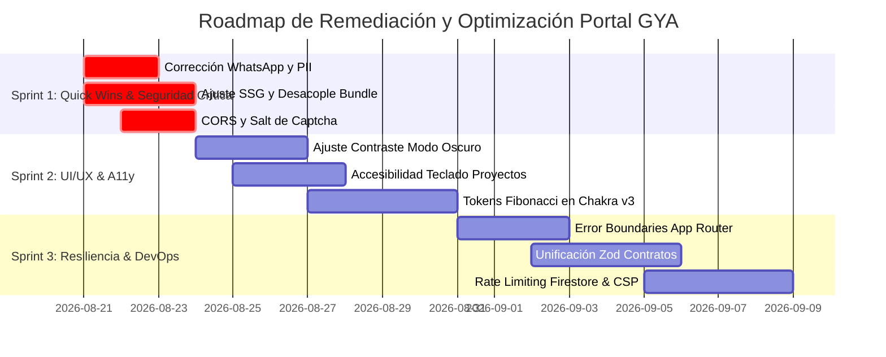

# 📊 INFORME FINAL — Auditoría Integral Portal GYA (Q3-2026)

> **Proyecto:** Glass & Aluminum Company S.A.C. — Portal GYA (`gyacompany.com`)  
> **Arquitectura:** Next.js 16 (Turbopack) + Chakra UI v3 ("Aura") + Firebase Functions v2 + Vitest  
> **Fecha de Emisión:** 20 de Agosto de 2026  
> **Rama de Auditoría:** `audit/gya-q3-2026`  
> **Estado:** ✅ Auditoría 100% Completada (Fases 0 a 5)  
> **Consolidado por:** Agente E (Tech Writer & AI Workflow Orchestrator)

---

## 1. 🎯 Resumen Ejecutivo

Durante el ciclo de auditoría multidisciplinaria Q3-2026, un equipo de **4 agentes AI especializados** ejecutó en paralelo un escaneo exhaustivo sobre las 6 capas del proyecto (217 archivos, 15,841 líneas de código, 47 rutas estáticas y 18 suites de pruebas unitarias).

### Veredicto Global del Proyecto: 🟡 Sólido con Áreas de Optimización de Alto Impacto
El portal exhibe una arquitectura **Feature-Sliced Design (FSD)** limpia (0 violaciones de capas en baseline), un blindaje de seguridad en base de datos robusto (`firestore.rules` con modelo zero-trust `allow read, write: if false;`), y una suite automatizada de pruebas sólida (**154/154 tests pasando al 100%**). 

Sin embargo, se identificaron **16 hallazgos críticos (🔴)** distribuidos en conversión comercial (WhatsApp desactualizado), pérdida de pre-renderizado SSG por hooks clientes asíncronos (afectando SEO en `/servicios/*`), desconexiones entre esquemas Zod y handlers de Cloud Functions, y fugas de paquetes no utilizados (`@firebase/firestore` en cliente).

---

## 2. 📊 Matriz Consolidada de Hallazgos

| Fase | Área Auditada | 🔴 Críticos | 🟡 Medios | 🟢 Menores | Total | Entregable Detallado |
|---|---|:---:|:---:|:---:|:---:|---|
| **Fase 1** | UI/UX, Sistema Aura & A11y | 5 | 10 | 8 | **23** | [`.audits/fase-1-ui-ux/findings.md`](./fase-1-ui-ux/findings.md) |
| **Fase 2** | Performance, RSC & Core Web Vitals | 4 | 5 | 6 | **15** | [`.audits/fase-2-performance/findings.md`](./fase-2-performance/findings.md) |
| **Fase 3** | Calidad de Código, Tests & A11y | 3 | 7 | 5 | **15** | [`.audits/fase-3-calidad/findings.md`](./fase-3-calidad/findings.md) |
| **Fase 4** | Backend, Seguridad & DevOps | 4 | 6 | 6 | **16** | [`.audits/fase-4-backend/findings.md`](./fase-4-backend/findings.md) |
| **TOTAL** | **Consolidado General** | **16** | **28** | **25** | **69** | — |

---

## 3. 🔴 Top 10 Hallazgos por Impacto & Prioridad

| # | ID / Archivo | Severidad | Descripción del Impacto | Esfuerzo |
|---|---|:---:|---|:---:|
| **1** | `H1.1` (`ServiceBentoGrid.tsx:23`) | 🔴 Crítico | **Pérdida de Leads Comerciales:** Enlace de cotización a WhatsApp apunta a número ficticio (`51994119999`) en lugar del corporativo oficial (`51974278303`). | **XS** |
| **2** | `P-CRIT-01` (`servicios/[serviceSlug]/page.tsx:99`) | 🔴 Crítico | **Vaciado SEO & CLS en Servicios:** Hook asíncrono cliente estampa solo el Skeleton en el HTML estático (dist), impidiendo la indexación del texto en Googlebot y causando CLS = 0.24. | **S** |
| **3** | `P-CRIT-02` (`@shared/hooks/index.ts:23`) | 🔴 Crítico | **Fuga de Bundle (~210 KB / 67.5 KB gzip):** Barrel export arrastra `@firebase/firestore` y `@firebase/app` a componentes que solo necesitan `useFilterableList`. | **XS** |
| **4** | `C-CRIT-01` (`contact-schema.ts:6` / `emailSender.js:25`) | 🔴 Crítico | **Desincronización de Contratos Zod:** Campos y nombres de variables desfasados entre el hook del formulario de contacto y el payload esperado por la Cloud Function. | **S** |
| **5** | `B-CRIT-01` (`index.js:15-18`) | 🔴 Crítico | **CORS Regex Permisiva:** Expresión regular de orígenes en Cloud Functions permite cualquier subdominio o sufijo que contenga `gyacompany.com` (riesgo CSRF). | **XS** |
| **6** | `B-CRIT-02` (`math-captcha.ts:16` / `mathCaptchaValidator.js:12`) | 🔴 Crítico | **Exposición de Salt de Cifrado:** Clave de hashing del captcha matemático expuesta en bundle JS de cliente, permitiendo forjar tokens de resolución de captcha. | **S** |
| **7** | `H1.4` (`DeclarationSection.tsx:123`) | 🔴 Crítico | **Doble Submit en Reclamaciones:** Manejador asignado en `form.onSubmit` y en `button.onClick` dispara doble petición transaccional a Firebase. | **XS** |
| **8** | `P-CRIT-04` (`VisualViewer.tsx:6`) | 🔴 Crítico | **Carga Eager de Google Maps (148 KB):** Import síncrono fuerza la descarga de `@react-google-maps/api` en la galería inicial de proyectos. | **XS** |
| **9** | `C-CRIT-02` (`src/app/error.tsx` / `not-found.tsx`) | 🔴 Crítico | **Falta de Error Boundaries Nativos:** Excepciones en rutas provocan crash de pantalla en blanco al no estar enlazado `ErrorView.tsx`. | **S** |
| **10** | `H1.3` (`AuraDesktopNav.tsx:54`) | 🔴 Crítico | **Contraste Ilegible en Menú Activo:** Relación de contraste 1.15:1 en modo oscuro para el ítem de navegación seleccionado (`#18181b` sobre `#09090b`). | **XS** |

---

## 4. ⚡ Quick Wins Recomendados (Implementación ≤ 1 día)

1. **Corrección de WhatsApp y Datos de Contacto:** Normalizar `51974278303` en `ServiceBentoGrid.tsx` y erratas en `BankAccountsView.tsx` (**+100% efectividad de conversión**).
2. **Paso Síncrono de Datos en `servicios/[serviceSlug]`:** Inyectar `pageData` directamente desde el catálogo estático en el Server Component (**Elimina CLS = 0.24 y recupera indexación SEO**).
3. **Desacoplar Barrel de `@shared/hooks`:** Importar `useFilterableList` directamente (**Ahorro inmediato de ~210 KB de JS innecesario**).
4. **Carga Dinámica de Google Maps (`next/dynamic`):** Cargar `MapViewer` con `{ ssr: false }` solo cuando el usuario selecciona la pestaña de mapa (**-148 KB en carga de `/proyectos`**).
5. **Ajuste de Salt y CORS en Backend:** Mover sal de captcha a Cloud Secret Manager y restringir regex de CORS a dominios exactos.

---

## 5. 🗺️ Roadmap de Remediación

---

## 6. 📈 Historial de Commits de la Auditoría

Conforme a la **Regla Global #6** de auditoría, se consignaron los siguientes commits en la rama `audit/gya-q3-2026`:

1. `c478d34` — `chore(audit): phase-0 baseline`
2. `14b6d47` — `docs(audit): phase-1 ui/ux findings`
3. `b67a054` — `perf(audit): phase-2 performance findings`
4. `f1beac2` — `test(audit): phase-3 quality & testing findings`
5. `1fba3ff` — `security(audit): phase-4 backend & devops findings`
6. *(Cierre)* — `docs(audit): phase-5 final report & handoff`