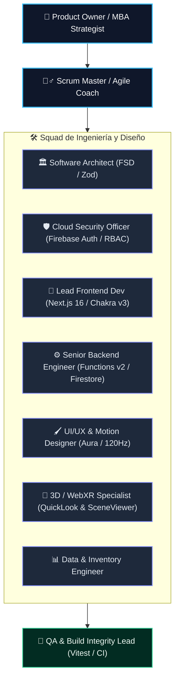

# $\mathbb{R}\mathrm{OADMAP}\;\|\;\text{Plan de Trabajo Ágil (Scrum) por Sprints y Fases}$

$$\text{\bfseries Portal Corporativo \& Transaccional GYA — Glass \& Aluminum Company S.A.C.}$$
$$\text{Documento de Gestión Ágil } \cdot \text{Scrum Framework } \cdot \text{Anno Domini 2026}$$

$$\rule{\linewidth}{0.8pt}$$

> **Resumen Ejecutivo (Executive Summary):**  
> Este documento establece el marco de trabajo ágil (**Scrum Framework**) para la construcción de la plataforma transaccional de **Glass & Aluminum Company S.A.C.** El plan se estructura en **5 Sprints / Fases Incrementales** con Definition of Done ($\text{DoD}$), ceremonias ágiles simuladas (Sprint Planning, Daily Standup, Sprint Review, Retrospective) y asignación estricta de tareas por cada uno de los roles especialistas senior del equipo técnico y de negocio.

$$\rule{\linewidth}{0.4pt}$$

## $\S\;1.\;\text{Estructura del Equipo Scrum \& Roles Seniors Asignados}$

$$\rule{\linewidth}{0.4pt}$$

## $\S\;2.\;\text{Roadmap General de Sprints (Fases de Ejecución)}$

$$\begin{array}{|c|l|l|c|c|}
\hline
\textbf{Sprint} & \textbf{Objetivo del Incremento} & \textbf{Enfoque Principal} & \textbf{Estimación} & \textbf{Estado} \\
\hline
\textbf{Sprint 1} & \text{Autenticación RBAC \& Perfil de Cliente} & \text{Auth, Roles (Admin/Cliente), DNI/RUC} & \text{Sprint 1} & \text{⏳ Listo para Ejecución} \\
\textbf{Sprint 2} & \text{Gestión de Inventario \& Panel Admin CRUD} & \text{Stock, Alertas, Medidas, Fotos en Storage} & \text{Sprint 2} & \text{⏳ Backlog} \\
\textbf{Sprint 3} & \text{Catálogo E-Commerce \& Carrito de Compras} & \text{Filtros, Checkout, WhatsApp/Transferencia} & \text{Sprint 3} & \text{⏳ Backlog} \\
\textbf{Sprint 4} & \text{Cotizador Inteligente \& Presupuesto en PDF} & \text{Motor Paramétrico m², Hoja A4 con QR} & \text{Sprint 4} & \text{⏳ Backlog} \\
\textbf{Sprint 5} & \text{Visor de Realidad Aumentada (AR Web)} & \text{Apple QuickLook .usdz, SceneViewer .glb} & \text{Sprint 5} & \text{⏳ Backlog} \\
\hline
\end{array}$$

$$\rule{\linewidth}{0.4pt}$$

## 🏃‍♂️ SPRINT 1: Autenticación RBAC, Sesiones y Perfiles de Cliente

> **Meta del Sprint (Sprint Goal):** Proveer un sistema seguro de inicio de sesión y registro para clientes (con DNI/RUC, teléfono, dirección y distrito) y administradores, con control de acceso basado en roles (RBAC) y contexto global de sesión.

### 📋 Checklist de Actividades por Rol Senior:

#### 1. 🛡️ Cloud & Security Officer
- [ ] **1.1** Configurar métodos de inicio de sesión en Firebase Auth (Email & Password).
- [ ] **1.2** Implementar reglas de validación en `firestore.rules` para la colección `/users` y `/clientes`.
- [ ] **1.3** Garantizar que un usuario no pueda auto-asignarse el rol `admin` desde el frontend.

#### 2. 🏛️ Enterprise Software Architect
- [ ] **1.4** Crear contexto global de autenticación `AuthContext` en `src/features/auth/context/AuthContext.tsx`.
- [ ] **1.5** Diseñar los hooks de negocio `useAuth` y `useUserProfile` con sincronización de Firestore.
- [ ] **1.6** Implementar guardias de rutas protegidas para la sección administrativa (`/admin/**`) y de cliente (`/mi-cuenta/**`).

#### 3. 🎨 Lead Frontend & UI/UX Designer
- [ ] **1.7** Diseñar la pantalla de Login con estética Aura Glass en `src/screens/Auth/LoginScreen.tsx`.
- [ ] **1.8** Diseñar el formulario de Registro de Clientes con validación en vivo de DNI (8 dígitos) y RUC (11 dígitos).
- [ ] **1.9** Añadir microinteracciones de carga con spinner y toasts de notificación accesibles.

#### 4. 🧪 QA & Build Integrity Lead
- [ ] **1.10** Crear suite de pruebas unitarias `tests/unit/auth-service.test.ts`.
- [ ] **1.11** Validar que `pnpm run test:run` y `pnpm run typecheck` pasen al 100%.

$$\rule{\linewidth}{0.4pt}$$

## 🏃‍♂️ SPRINT 2: Gestión de Inventario & Panel de Administración (CRUD)

> **Meta del Sprint (Sprint Goal):** Permitir al administrador gestionar el inventario en tiempo real: crear, listar, editar y deshabilitar productos (vidrios, perfiles de aluminio y accesorios), controlar existencias (stock) y recibir alertas de stock mínimo.

### 📋 Checklist de Actividades por Rol Senior:

#### 1. 📊 Data & Inventory Engineer
- [ ] **2.1** Crear servicio de base de datos `src/features/products/services/productService.ts` con consultas indexadas y soporte para paginación/filtrado.
- [ ] **2.2** Configurar subida de imágenes de producto a Firebase Storage en la ruta `products/{productId}/thumbnail.webp`.

#### 2. 🎨 Lead Frontend Dev & UI/UX Designer
- [ ] **2.3** Construir el Dashboard de Inventario en `src/screens/Admin/InventoryScreen.tsx` con tabla responsiva Aura.
- [ ] **2.4** Diseñar modal interactivo de creación/edición de productos con selector de unidad ($m^2$, barras, unidades, kg) y dimensiones.
- [ ] **2.5** Implementar badge visual de advertencia de stock bajo ($\text{stock} \le \text{minStockAlert}$).

#### 3. 💼 MBA & Product Strategist
- [ ] **2.6** Validar cálculo de margen bruto ($\text{Margen} = \frac{\text{unitPrice} - \text{costPrice}}{\text{unitPrice}}$) en el formulario de edición de precios.

#### 4. 🧪 QA & Build Integrity Lead
- [ ] **2.7** Pruebas unitarias de mutación de stock y validación Zod en `tests/unit/inventory-crud.test.ts`.

$$\rule{\linewidth}{0.4pt}$$

## 🏃‍♂️ SPRINT 3: Catálogo E-Commerce & Carrito de Compras

> **Meta del Sprint (Sprint Goal):** Ofrecer una experiencia de compra fluida al cliente para adquirir vidrios, perfiles y accesorios, con carrito de compras reactivo, cálculo de subtotales y opciones de checkout formal (transferencia bancaria / WhatsApp corporativo).

### 📋 Checklist de Actividades por Rol Senior:

#### 1. 🏛️ Enterprise Software Architect
- [ ] **3.1** Crear store reactivo de carrito de compras `useCartStore` con persistencia en `localStorage`.
- [ ] **3.2** Validar que la cantidad en carrito no exceda el stock disponible en Firestore.

#### 2. 🎨 Lead Frontend & UI/UX Designer
- [ ] **3.3** Construir la vista de Catálogo Comercial en `src/screens/Tienda/ShopScreen.tsx` con filtros por categoría.
- [ ] **3.4** Diseñar Drawer lateral de Carrito de Compras con micro-animaciones Framer Motion a 120Hz.
- [ ] **3.5** Crear pantalla de Checkout (`/tienda/checkout`) con resumen de compra y datos de envío/visita técnica.

#### 3. 💼 MBA & Product Strategist
- [ ] **3.6** Implementar sugerencias de productos complementarios (Cross-selling: ej. si compras perfil Serie 25, sugerir rodajes y cerradura pico de loro).

#### 4. 🧪 QA & Build Integrity Lead
- [ ] **3.7** Tests unitarios del flujo de carrito y cálculos de totales en `tests/unit/cart-engine.test.ts`.

$$\rule{\linewidth}{0.4pt}$$

## 🏃‍♂️ SPRINT 4: Cotizador Inteligente & Generador de Presupuesto en PDF

> **Meta del Sprint (Sprint Goal):** Automatizar el cálculo de presupuestos de obras e instalaciones a medida (ventanas, mamparas, duchas, techos) con desglose exacto de materiales, mano de obra, IGV y generación de documento membretado en PDF con código QR legal.

### 📋 Checklist de Actividades por Rol Senior:

#### 1. 💼 MBA & Software Architect
- [ ] **4.1** Implementar motor matemático de presupuestación en `src/features/presupuesto/utils/quoteCalculator.ts`:
  $$\text{Total} = \left[ (\text{Vidrio } m^2 \times P_v) + (\text{Aluminio Metros} \times P_a) + \text{Accesorios} + \text{Mano de Obra} \right] \times 1.18$$
- [ ] **4.2** Permitir la carga y parametrización de la tabla de precios oficial de GYA.

#### 2. 🎨 Lead Frontend & Web Designer
- [ ] **4.3** Construir el Cotizador Interactivo Paso a Paso (Wizard) en `src/screens/Presupuesto/PresupuestoWizard.tsx`.
- [ ] **4.4** Diseñar la plantilla de Hoja de Presupuesto Membretada A4 (`@media print`) con logo oficial de GYA, RUC, tabla de partidas y código QR de verificación.
- [ ] **4.5** Implementar botón de confirmación de solicitud (*"Aceptar Presupuesto y Agendar Visita Técnica"*), persistiendo el registro en la colección Firestore `/presupuestos_solicitados`.

#### 3. 🧪 QA & Build Integrity Lead
- [ ] **4.6** Tests unitarios con casos extremos de metraje y verificación del correlativo `GYA-2026-XXXX`.

$$\rule{\linewidth}{0.4pt}$$

## 🏃‍♂️ SPRINT 5: Visor de Realidad Aumentada (AR Web Nativa)

> **Meta del Sprint (Sprint Goal):** Permitir a los clientes proyectar en escala 1:1 ventanas, mamparas y puertas de ducha en sus espacios reales usando la cámara de su celular sin instalar apps externas.

### 📋 Checklist de Actividades por Rol Senior:

#### 1. 🥽 3D & WebXR Specialist
- [ ] **5.1** Integrar el componente estándar `<model-viewer>` de Google en `src/shared/components/3d/AuraModelViewer.tsx`.
- [ ] **5.2** Configurar compatibilidad con Apple QuickLook (`.usdz`) para dispositivos iOS (iPhone / iPad).
- [ ] **5.3** Configurar compatibilidad con Google Scene Viewer (`.glb`) para dispositivos Android.
- [ ] **5.4** Crear fallback en Desktop: Visor 3D interactivo con rotación 360° y generación de código QR para proyección móvil instantánea.

#### 2. 🎨 Lead Frontend Dev & 3D Artist
- [ ] **5.5** Integrar botón *"Ver en tu espacio (Realidad Aumentada)"* en las tarjetas de producto y catálogo de servicios.
- [ ] **5.6** Probar prototipos 3D de:
  - Mampara Corrediza de Vidrio Templado Serie 25 (Negro Mate).
  - Ventana Antirruido Sistema Nova.

#### 3. 🧪 QA & Security Lead
- [ ] **5.7** Verificar rendimiento de carga WebGL/WebXR en móviles ($\text{FPS} \ge 60$) y auditoría de accesibilidad.

$$\rule{\linewidth}{0.4pt}$$

## 🎯 Definition of Done ($\text{DoD}$) para cada Sprint:

1. **Código:** 100% tipado en TypeScript con arquitectura FSD y Zod.
2. **Seguridad:** Reglas Firestore y Storage actualizadas bajo principio Zero-Trust.
3. **Pruebas:** 100% de tests unitarios de Vitest pasando sin errores.
4. **Calidad de Código:** Cero advertencias y errores en `pnpm run lint`.
5. **Compilación:** `pnpm run build` ejecutado exitosamente con todas las rutas estáticas pre-renderizadas.
6. **Git:** Commit semántico registrado y sincronizado en `origin/main`.

$$\rule{\linewidth}{0.8pt}$$
$$\text{\footnotesize Glass \& Aluminum Company S.A.C. — Framework Ágil Scrum 2026.}$$
