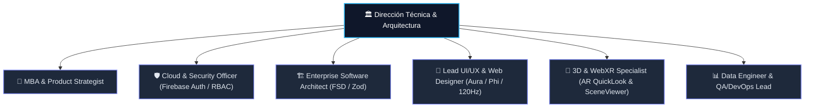
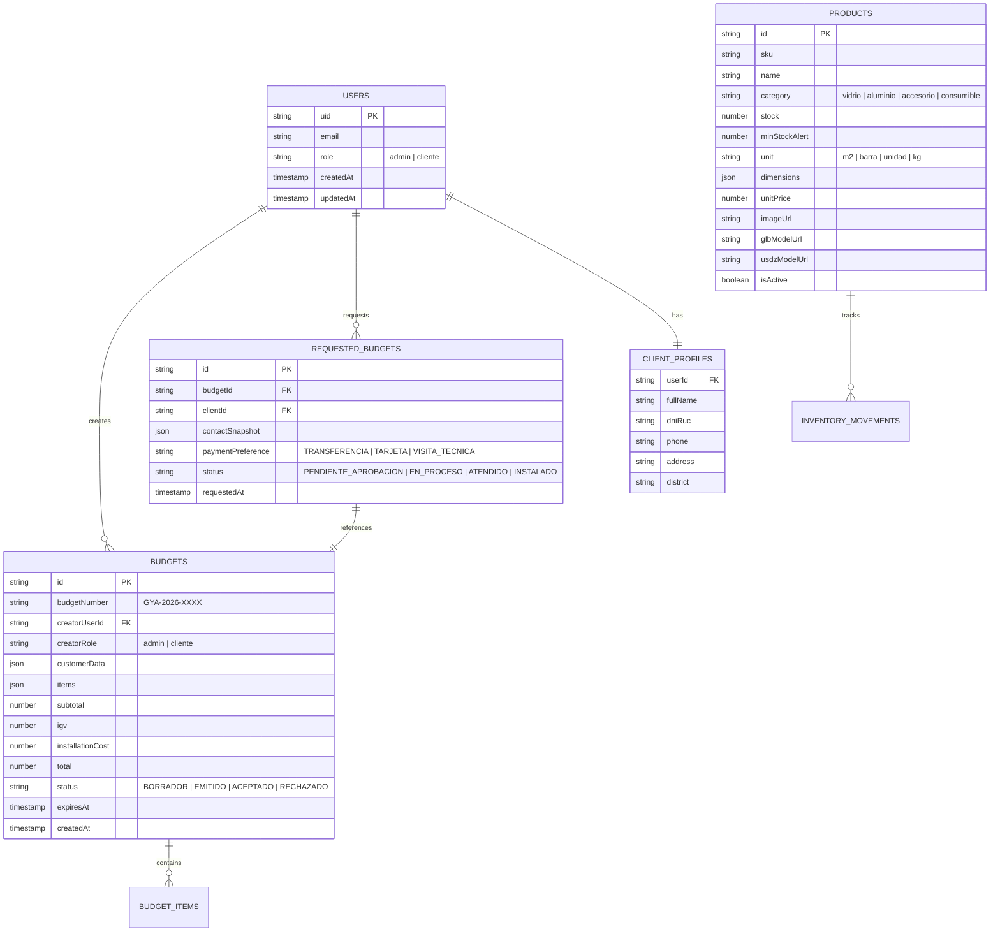

# 🏛️ Plan Maestro Multidisciplinario: E-Commerce, Inventario en Tiempo Real, Sistema de Presupuestos con PDF y Realidad Aumentada (AR)

$$\text{\bfseries Glass \& Aluminum Company S.A.C. — Portal GYA}$$
$$\text{Documento de Especificación de Producto \& Arquitectura Empresarial } \cdot \text{Anno Domini 2026}$$

---

## 👥 1. Panel del Comité Multidisciplinario de Ingeniería & Negocio

Para asegurar una implementación de nivel internacional, este plan ha sido diseñado e integrado por un comité de roles especializados:



1. **💼 MBA & Product Strategist:** Define la viabilidad comercial, estrategia de conversión (B2C y B2B para instaladores), modelo de inventario, pricing dinámico y mejores prácticas globales de E-commerce (inspirado en líderes de la industria como Shopify Plus, Procore y Amazon B2B).
2. **🛡️ Cloud & Security Officer:** Diseña el modelo de autenticación RBAC (*Role-Based Access Control*), reglas zero-trust en `firestore.rules` y `storage.rules`, protección de claves de API y prevención de fugas de datos de clientes y precios de costo.
3. **🏗️ Enterprise Software Architect:** Estructura modular bajo **Feature-Sliced Design (FSD)** en Next.js 16 (App Router), contratos Zod compartidos entre frontend y Cloud Functions, y microservicios serverless idempotentes.
4. **🎨 Lead UI/UX & Web Designer:** Diseña la experiencia de usuario bajo el sistema Aura, escala Fibonacci ($\Phi$), microinteracciones a 120Hz, generador de presupuesto con formato imprimible oficial y responsive design móvil.
5. **🥽 3D & WebXR Specialist:** Diseña la arquitectura de Realidad Aumentada web nativa sin aplicaciones externas (iOS QuickLook `.usdz` y Android SceneViewer `.glb` con fallback 3D interactivo en desktop vía QR).
6. **📊 Data Engineer & QA/DevOps Lead:** Modela las colecciones Firestore, índices compuestos, suite de testing automatizada con Vitest y pipeline de CI/CD.

---

## 🏛️ 2. Arquitectura de Datos & Colecciones en Firestore

Se implementa una estructura relacional NoSQL optimizada para consultas de alta velocidad y consistencia transaccional:



### 📁 Rutas de Storage en Firebase
- `products/{productId}/thumbnail.webp`: Imagen optimizada de visualización en catálogo y panel admin.
- `products/{productId}/model.glb`: Modelo 3D para Android y Web 3D.
- `products/{productId}/model.usdz`: Modelo 3D para Realidad Aumentada en iOS (Apple QuickLook).
- `images/`: Archivos estáticos del frontend (ya existentes).

---

## 🔐 3. Modelo de Seguridad & Reglas de Firestore y Storage

### 🛡️ Reglas de Firestore (`firestore.rules`)
Se implementa RBAC validando el Custom Claim de autenticación o la colección `/users/{userId}`:

```javascript
rules_version = '2';
service cloud.firestore {
  match /databases/{database}/documents {
    
    // Función auxiliar para verificar si el usuario es Admin
    function isAdmin() {
      return request.auth != null && 
        (request.auth.token.role == 'admin' || 
         get(/databases/$(database)/documents/users/$(request.auth.uid)).data.role == 'admin');
    }
    
    // Función auxiliar para verificar si el usuario es el dueño del recurso
    function isOwner(userId) {
      return request.auth != null && request.auth.uid == userId;
    }

    // Colección de Usuarios y Roles
    match /users/{userId} {
      allow read: if isOwner(userId) || isAdmin();
      allow write: if isAdmin();
    }

    // Colección de Perfiles de Clientes (DNI, Teléfono, Dirección)
    match /clientes/{clientId} {
      allow read: if isOwner(clientId) || isAdmin();
      allow create: if request.auth != null && request.auth.uid == clientId;
      allow update: if isOwner(clientId) || isAdmin();
      allow delete: if isAdmin();
    }

    // Colección de Productos e Inventario
    match /productos/{productId} {
      allow read: if true; // Catálogo público para clientes y visitantes
      allow write: if isAdmin(); // Solo admins pueden crear/editar stock y precios
    }

    // Colección de Presupuestos
    match /presupuestos/{budgetId} {
      allow read: if isOwner(resource.data.creatorUserId) || isAdmin();
      allow create: if request.auth != null;
      allow update: if isOwner(resource.data.creatorUserId) || isAdmin();
      allow delete: if isAdmin();
    }

    // Colección de Presupuestos Solicitados (Aceptados)
    match /presupuestos_solicitados/{solicitudId} {
      allow read: if isOwner(resource.data.clientId) || isAdmin();
      allow create: if request.auth != null;
      allow update: if isAdmin();
      allow delete: if isAdmin();
    }

    // Colección Legal del Libro de Reclamaciones (Aislada a Cloud Functions)
    match /libro_de_reclamaciones/{reclamoId} {
      allow read, write: if false;
    }
  }
}
```

### 📦 Reglas de Firebase Storage (`storage.rules`)
```javascript
rules_version = '2';
service firebase.storage {
  match /b/{bucket}/o {
    
    // Lectura pública de imágenes frontend y productos
    match /images/{allPaths=**} {
      allow read: if true;
      allow write: if false;
    }

    match /products/{allPaths=**} {
      allow read: if true;
      // Solo el Administrador autenticado puede subir fotos y modelos 3D
      allow write: if request.auth != null && request.auth.token.role == 'admin';
    }

    match /{allPaths=**} {
      allow read, write: if false;
    }
  }
}
```

---

## 🧮 4. Motor de Presupuestos y Cotizador Inteligente

### Lógica de Cálculo de Presupuesto (Configurable & Extensible):
$$\text{Subtotal Materiales} = \sum (\text{Vidrio } \text{m}^2 \times \text{Precio}) + \sum (\text{Aluminio Metros} \times \text{Precio}) + \sum (\text{Accesorios})$$
$$\text{Costo Instalación} = \text{Mano de Obra}(\text{m}^2 \text{ o Tipo de Sistema}) + \text{Dificultad de Acceso (Piso/Andamio)}$$
$$\text{Total Presupuesto} = (\text{Subtotal Materiales} + \text{Costo Instalación}) \times 1.18 \;\text{(IGV)}$$

### 📄 Impresión & Descarga en PDF:
- Hoja membretada oficial con logo de **Glass & Aluminum Company S.A.C.**, RUC `20601542407`, dirección en La Molina, teléfonos y código de presupuesto con código QR de verificación.
- Hoja de estilo CSS `@media print` optimizada para salida limpia en A4 sin botones ni cabeceras web superfluas.

---

## 🥽 5. Módulo de Realidad Aumentada (AR) Web Nativa

1. **Componente Visual:** `src/shared/components/3d/AuraModelViewer.tsx`
2. **Compatibilidad:**
   - **iOS (iPhone/iPad):** Activa el motor Apple QuickLook nativo con archivos `.usdz`.
   - **Android:** Activa Google Scene Viewer / WebXR con archivos `.glb`.
   - **PC Desktop:** Renderiza visor 3D interactivo con rotación 360° y botón *"Escanear con tu Celular (QR)"* para proyectarlo en el espacio del usuario.
3. **Prototipo Inicial de Demostración:**
   - Mampara Corrediza de Vidrio Templado Serie 25 con perfiles de aluminio negro.
   - Ventana Antirruido Sistema Nova.

---

## 🗺️ 6. Fases de Implementación Propuestas

```
├── Fase 1: Capa de Autenticación RBAC & Perfiles (Admin vs Cliente)
├── Fase 2: Módulo CRUD de Productos & Control de Inventario (Admin)
├── Fase 3: Catálogo E-Commerce & Carrito de Compras (Frontend)
├── Fase 4: Cotizador Inteligente & Generador de Presupuesto Imprimible
├── Fase 5: Módulo de Realidad Aumentada (AR 3D Web) & Validación Final
```

---

## 🧪 7. Plan de Verificación & QA
1. **Pruebas de Seguridad:** Validación de reglas Firestore impidiendo que un usuario cliente modifique stock o acceda a presupuestos ajenos.
2. **Pruebas de Cálculo:** Cobertura de tests unitarios con Vitest para los algoritmos de presupuestación y fórmulas métricas.
3. **Pruebas de UI/UX & Responsive:** Validación en resoluciones 375px (iPhone SE), 768px (iPad) y 1440px (Desktop).
4. **Validación de Build:** `pnpm run typecheck && pnpm run lint && pnpm run build`.
