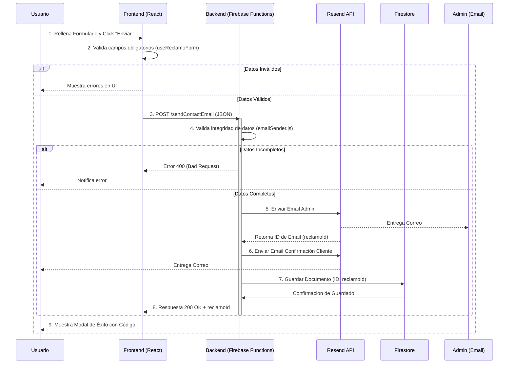

# Documentación Técnica: Libro de Reclamaciones Virtual

| Metadato                  | Detalle                                      |
| :------------------------ | :------------------------------------------- |
| **Proyecto**              | GYA Glass & Aluminum Web App                 |
| **Módulo**                | Atención al Cliente / Legal                  |
| **Versión del Documento** | 1.0.0                                        |
| **Fecha**                 | 28/11/2025                                   |
| **Autor**                 | Senior Fullstack Web Architect (Antigravity) |
| **Estado**                | Implementado y Validado                      |

---

## 1. Introducción

Este documento describe la implementación técnica del flujo del **Libro de Reclamaciones Virtual**. Esta funcionalidad permite a los usuarios registrar quejas o reclamos conforme a la normativa legal vigente (Indecopi - Perú), asegurando la notificación inmediata tanto al usuario como a la administración, y la persistencia de los datos para auditoría.

## 2. Descripción del Caso de Uso

El usuario accede a la sección "Libro de Reclamaciones", completa un formulario con sus datos personales, detalles del bien contratado y el motivo del reclamo. Al enviar, el sistema valida la información, procesa el envío de correos electrónicos transaccionales y almacena el registro en una base de datos segura.

## 3. Requerimientos

### 3.1 Requerimientos Funcionales (RF)

- **RF-01:** El sistema debe permitir el ingreso de datos personales (Nombre, DNI/CE, Domicilio, Teléfono, Email).
- **RF-02:** El sistema debe diferenciar entre "Producto" y "Servicio", y entre "Queja" y "Reclamo".
- **RF-03:** El sistema debe validar que todos los campos obligatorios estén completos antes del envío.
- **RF-04:** El sistema debe enviar un correo de confirmación al usuario con un código de seguimiento (ID).
- **RF-05:** El sistema debe enviar un correo detallado al administrador con toda la información del reclamo.
- **RF-06:** El sistema debe guardar el reclamo en una base de datos (Firestore) con fecha y hora exacta.

### 3.2 Requerimientos No Funcionales (RNF)

- **RNF-01 Seguridad:** La comunicación debe ser encriptada (HTTPS).
- **RNF-02 Disponibilidad:** El servicio de envío de correos debe ser resiliente (Uso de API externa robusta: Resend).
- **RNF-03 Usabilidad:** El formulario debe ser responsivo y fácil de usar en dispositivos móviles.
- **RNF-04 Integridad:** No se deben procesar reclamos con datos incompletos en el backend.

---

## 4. Arquitectura y Tecnologías

La solución utiliza una arquitectura **Serverless** para el backend y **SPA (Single Page Application)** para el frontend.

- **Frontend:** React 18, Chakra UI, React Hook Form (Custom implementation).
- **Backend:** Firebase Cloud Functions (Node.js 20).
- **Base de Datos:** Google Cloud Firestore (NoSQL).
- **Servicio de Email:** Resend API.

---

## 5. Diagrama de Secuencia (Flujo de Datos)

---

## 6. Detalle de Implementación: Frontend

### 6.1 Componentes Clave

- **`ReclamationForm.jsx`**: Componente de presentación. Utiliza Chakra UI para el diseño visual (Glassmorphism). Contiene los inputs controlados para todos los campos legales requeridos.
- **`SuccessModal.jsx`**: Modal que aparece solo cuando la operación es exitosa, mostrando el ID del reclamo.

### 6.2 Lógica de Negocio (Hooks & Services)

- **`useReclamoForm.js` (Custom Hook):**
  - Maneja el estado del formulario (`formData`).
  - Implementa la función `validateForm` que verifica reglas de negocio (ej. formato de email, campos vacíos).
  - Gestiona el estado de carga y errores.
- **`reclamoService.js` (Service Layer):**
  - Encapsula la comunicación con la API.
  - Realiza la petición `fetch` al endpoint `VITE_API_URL`.
  - Maneja la respuesta JSON y lanza errores si el backend falla.

---

## 7. Detalle de Implementación: Backend

### 7.1 Entry Point (`index.js`)

- **Función:** `sendContactEmail`
- **Tipo:** HTTP v2 (`onRequest`).
- **Configuración:** Habilitado CORS, Timeout 60s, Acceso a secretos (`RESEND_API_KEY`).
- **Responsabilidad:** Recibir la petición, verificar método POST y delegar la lógica.

### 7.2 Lógica Core (`emailSender.js`)

Este módulo contiene la inteligencia del proceso:

1.  **Validación Estricta:** Se verifica que existan los 11 campos obligatorios (nombre, dni, domicilio, etc.). Si falta uno, se detiene la ejecución para proteger recursos.
2.  **Generación de HTML:** Utiliza plantillas literales (`createAdminEmailHtml`, `createClientEmailHtml`) para formatear los correos de manera profesional.
3.  **Integración con Resend:**
    - Primero envía al Admin para asegurar que la empresa se entere.
    - Obtiene el ID del correo generado por Resend y lo usa como `reclamoId`.
    - Luego envía la confirmación al Cliente.
4.  **Persistencia (Firestore):**
    - Guarda todo el objeto del reclamo en la colección `libro_de_reclamaciones`.
    - Usa el `reclamoId` como llave del documento para fácil búsqueda.
    - Agrega `serverTimestamp()` para auditoría exacta.

---

## 8. Paso a Paso: Ciclo de Vida de un Reclamo

1.  **Inicio:** El cliente entra a `/libro-de-reclamacion`.
2.  **Llenado:** El cliente completa sus datos. El frontend valida en tiempo real (feedback visual).
3.  **Envío:** Al hacer submit, `useReclamoForm` bloquea el botón y llama a `reclamoService`.
4.  **Procesamiento:** La Cloud Function se despierta, valida los datos y contacta a Resend.
5.  **Notificación:**
    - El Admin recibe: "Nuevo Reclamo de [Nombre]".
    - El Cliente recibe: "Confirmación de Reclamo - Código [ID]".
6.  **Registro:** Los datos quedan inmutables en Firestore.
7.  **Confirmación:** El frontend recibe el OK y muestra el modal: "Su reclamo ha sido registrado con el código [ID]".
8.  **Redirección:** Al cerrar el modal, el usuario es redirigido al Home.

---

## 9. Conclusión

La implementación actual es robusta, segura y cumple con los estándares legales. La separación de responsabilidades entre Frontend y Backend asegura que la lógica de validación crítica y las credenciales de API permanezcan seguras en el servidor, mientras que el usuario disfruta de una experiencia fluida y rápida.
