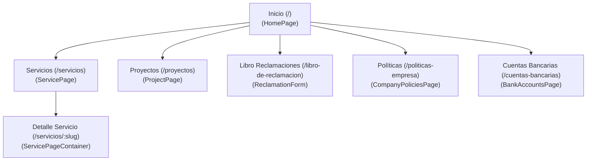

# Documentación Global de Casos de Uso: GYA Glass & Aluminum

| Metadato | Detalle |
| :--- | :--- |
| **Proyecto** | GYA Glass & Aluminum Web App |
| **Alcance** | Sistema Completo (Frontend + Backend) |
| **Fecha** | 28/11/2025 |
| **Autor** | Luis Cueva (Generado por AI Assistant) |
| **Versión** | 1.0.0 |

---

## 1. Introducción

Este documento detalla todos los casos de uso identificados para la aplicación web de GYA Glass & Aluminum. El sistema tiene como objetivo principal presentar el portafolio de servicios y proyectos de la empresa, brindar información corporativa transparente y ofrecer un canal formal para la gestión de reclamos.

## 2. Actores

*   **Visitante Web (Usuario):** Persona que accede al sitio web a través de un navegador. Su objetivo es obtener información sobre los servicios de vidriería y aluminio, ver trabajos previos o contactar a la empresa.
*   **Administrador (Staff GYA):** Personal de la empresa que recibe las notificaciones del sistema (correos electrónicos de reclamos) y gestiona la atención al cliente offline.
*   **Sistema (Backend Firebase):** Actor autómata que procesa las solicitudes, valida datos, envía correos y persiste información en la base de datos.

---

## 3. Diagrama de Casos de Uso (Nivel Alto)

```mermaid
usecaseDiagram
    actor "Visitante Web" as User
    actor "Administrador" as Admin
    actor "Sistema (Firebase)" as System

    package "GYA Web App" {
        usecase "Visualizar Inicio\n(Landing Page)" as UC1
        usecase "Explorar Servicios" as UC2
        usecase "Ver Detalle de Servicio" as UC3
        usecase "Explorar Proyectos" as UC4
        usecase "Consultar Políticas" as UC5
        usecase "Ver Cuentas Bancarias" as UC6
        usecase "Registrar Reclamo" as UC7
    }

    User --> UC1
    User --> UC2
    User --> UC3
    User --> UC4
    User --> UC5
    User --> UC6
    User --> UC7

    UC7 ..> System : "Procesa y Guarda"
    System --> Admin : "Notifica por Email"
    System --> User : "Confirma por Email"
```

---

## 4. Detalle de Casos de Uso

### CU-01: Visualizar Inicio (Landing Page)
*   **Descripción:** El usuario accede a la página principal (`/`).
*   **Flujo:**
    1.  El sistema carga el `HomePage`.
    2.  El usuario visualiza la sección "Hero" (bienvenida).
    3.  El usuario hace scroll y ve secciones destacadas: Clientes (`ClientsSection`), Características (`FeaturesSection`) y un resumen de la tienda/servicios (`StoreSection`).
*   **Objetivo:** Captar la atención del usuario y dirigirlo a las secciones de interés.

### CU-02: Explorar Catálogo de Servicios
*   **Descripción:** El usuario desea conocer qué ofrece la empresa.
*   **Flujo:**
    1.  El usuario navega a `/servicios`.
    2.  El sistema muestra una lista (`ServiceList`) con tarjetas de los servicios disponibles.
*   **Precondición:** Ninguna.

### CU-03: Ver Detalle de Servicio
*   **Descripción:** El usuario quiere información específica sobre un servicio (ej. "Ventanas Modena").
*   **Flujo:**
    1.  Desde la lista de servicios, el usuario hace clic en una tarjeta.
    2.  El sistema navega a `/servicios/:serviceSlug`.
    3.  Se carga `ServicePageContainer` con la información detallada, imágenes y especificaciones del servicio seleccionado.

### CU-04: Explorar Portafolio de Proyectos
*   **Descripción:** El usuario desea ver trabajos realizados para validar la calidad.
*   **Flujo:**
    1.  El usuario navega a `/proyectos`.
    2.  El sistema muestra una galería de proyectos realizados.
    3.  El usuario puede ver imágenes y descripciones breves de las obras.

### CU-05: Consultar Información Corporativa
*   **Descripción:** El usuario busca información legal o administrativa.
*   **Flujo:**
    1.  El usuario navega a `/politicas-empresa` o `/cuentas-bancarias`.
    2.  El sistema muestra el texto estático correspondiente (Términos y condiciones, números de cuenta, etc.).

### CU-06: Registrar Reclamo/Queja (Libro de Reclamaciones)
*   **Descripción:** El usuario desea formalizar una insatisfacción.
*   **Referencia:** Ver documento detallado `docs/CASO_USO_LIBRO_RECLAMACIONES.md`.
*   **Flujo Resumido:**
    1.  Usuario entra a `/libro-de-reclamacion`.
    2.  Llena formulario legal.
    3.  Sistema valida y envía a Backend.
    4.  Backend guarda en Firestore y envía emails (a Admin y Usuario).
    5.  Frontend muestra confirmación con ID de seguimiento.

---

## 5. Mapa de Navegación del Sitio



## 6. Conclusión

La aplicación cubre satisfactoriamente los flujos de información (lectura) y el flujo transaccional crítico (reclamos). La arquitectura modular basada en rutas permite expandir fácilmente nuevos casos de uso, como por ejemplo, un futuro "Carrito de Compras" o "Cotizador Online", sin afectar la estructura actual.
