# $\mathbb{R}\mathrm{EADME}\;\|\;\text{Manual de Arquitectura e Ingeniería de Software}$

$$\text{\bfseries Portal Corporativo GYA — Glass \& Aluminum Company S.A.C.}$$
$$\text{Documento Técnico de Referencia } \cdot \text{Versión 2.0} \cdot \text{Anno Domini 2026}$$

$$\rule{\linewidth}{0.8pt}$$

> **Resumen Ejecutivo (Abstract):**  
> Este compendio constituye la especificación canónica y manual de ingeniería para el ecosistema **MyAppGlass** de *Glass & Aluminum Company S.A.C.* El sistema implementa una arquitectura desacoplada basada en **Next.js 16 (Turbopack, App Router)** bajo la metodología **Feature-Sliced Design (FSD)**, renderizado estático de alto rendimiento (SSG/Export), aceleración por GPU para tasas de refresco de $120\,\text{Hz}$, contratos de datos formales con **Zod $\land$ TypeScript**, y microservicios serverless en **Google Cloud Functions v2 $\land$ Firestore**.

$$\rule{\linewidth}{0.4pt}$$

## $\S\;1.\;\text{Tabla de Contenidos Estructurada (Table of Contents)}$

```
├── § 1. Tabla de Contenidos Estructurada
├── § 2. Taxonomía y Grafo de Navegación del Sistema
├── § 3. Módulos y Especificaciones Formales
│   ├── 3.1. Arquitectura y Gobierno del Código (Core Architecture)
│   │   ├── 01_ARCHITECTURE.md
│   │   ├── 02_AI_HANDOFF.md
│   │   ├── 03_AGENTS.md
│   │   ├── 04_PLAN_DE_TRABAJO.md
│   │   └── 05_CHANGELOG.md
│   ├── 3.2. Ingeniería de Frontend y Sistema de Diseño Aura (UI/UX Engine)
│   │   └── 06_DOCS_DEVELOPMENT.md
│   ├── 3.3. Infraestructura Backend, Seguridad y Normativa Legal (Backend & Compliance)
│   │   ├── 07_BACKEND_IMPLEMENTATION.md
│   │   └── 08_DOCS_SECURITY_BACKEND.md
│   ├── 3.4. Estrategia de SEO Técnico, Grafos de Conocimiento y Marketing (SEO & Discovery)
│   │   ├── 09_PLAN_SEO_CONTENIDOS.md
│   │   ├── 10_SEO_JERARQUIA.md
│   │   └── 11_MANUAL_SEO_LOCAL.md
│   ├── 3.5. Plataforma Transaccional: E-Commerce, Inventario, Presupuestos y AR (Next Generation)
│   │   └── 12_PLAN_ECOMMERCE_INVENTARIO_AR.md
│   └── 3.6. Gestión Ágil por Sprints: Framework Scrum y Roles Seniors (Agile Operations)
│       └── 13_PLAN_TRABAJO_SCRUM_FASES.md
├── § 4. Matriz de Decisiones de Ingeniería y Algoritmos (Complexity Matrix)
├── § 5. Guía de Operaciones y Casos de Uso Frecuentes (Standard Operating Procedures)
└── § 6. Protocolo de Calidad, Verificación Formal y CI/CD
```

$$\rule{\linewidth}{0.4pt}$$

## $\S\;2.\;\text{Taxonomía y Grafo de Navegación del Sistema}$

```mermaid
graph TD
    classDef root fill:#0f172a,stroke:#38bdf8,stroke-width:2px,color:#fff;
    classDef domain fill:#1e293b,stroke:#818cf8,stroke-width:1.5px,color:#e2e8f0;
    classDef leaf fill:#020617,stroke:#64748b,stroke-width:1px,color:#94a3b8;

    Root["📚 Manual Canónico (docs/README.md)"]:::root

    D1["§ 3.1. 🏛️ Arquitectura & Gobierno"]:::domain
    D2["§ 3.2. 💻 Frontend & Diseño Aura"]:::domain
    D3["§ 3.3. 🛡️ Backend & Seguridad"]:::domain
    D4["§ 3.4. 📈 SEO & Descubrimiento"]:::domain
    D5["§ 3.5. 🛒 E-Commerce & AR"]:::domain
    D6["§ 3.6. 🏃‍♂️ Scrum & Sprints"]:::domain

    Root --> D1
    Root --> D2
    Root --> D3
    Root --> D4
    Root --> D5
    Root --> D6

    D1 --> F01["01_ARCHITECTURE.md (FSD & Boxflow)"]:::leaf
    D1 --> F02["02_AI_HANDOFF.md (Contratos & Clean Code)"]:::leaf
    D1 --> F03["03_AGENTS.md (10 Roles Especializados)"]:::leaf
    D1 --> F04["04_PLAN_DE_TRABAJO.md (Roadmap 5 Fases)"]:::leaf
    D1 --> F05["05_CHANGELOG.md (Historial de Versiones)"]:::leaf

    D2 --> F06["06_DOCS_DEVELOPMENT.md (Tokens Fibonacci & 120Hz)"]:::leaf

    D3 --> F07["07_BACKEND_IMPLEMENTATION.md (Serverless & Resend)"]:::leaf
    D3 --> F08["08_DOCS_SECURITY_BACKEND.md (Secret Manager & Indecopi)"]:::leaf

    D4 --> F09["09_PLAN_SEO_CONTENIDOS.md (Topic Clusters & Blog)"]:::leaf
    D4 --> F10["10_SEO_JERARQUIA.md (Taxonomía H1-H3 & Metas)"]:::leaf
    D4 --> F11["11_MANUAL_SEO_LOCAL.md (Google Maps & Search Console)"]:::leaf

    D5 --> F12["12_PLAN_ECOMMERCE_INVENTARIO_AR.md (RBAC, Zod, PDF & WebXR)"]:::leaf

    D6 --> F13["13_PLAN_TRABAJO_SCRUM_FASES.md (Checklist por Roles & DoD)"]:::leaf
```



$$\rule{\linewidth}{0.4pt}$$

## $\S\;3.\;\text{Módulos y Especificaciones Formales}$

### $3.1.\;\text{Arquitectura y Gobierno del Código (Core Architecture)}$

$$\mathcal{D}_{\text{arch}} = \{\text{FSD Layers, Type Contracts, Agent Roles, Roadmap, Versioning}\}$$

* **[3.1.1. `01_ARCHITECTURE.md`](./01_ARCHITECTURE.md):**  
  Define la descomposición en capas FSD: $\text{app} \to \text{screens} \to \text{widgets} \to \text{features} \to \text{shared}$. Detalla el patrón de componentes compuestos ($\text{Gallery.Root} \circ \text{Viewer} \circ \text{Thumbnails}$) y el flujo desacoplado de datos.
* **[3.1.2. `02_AI_HANDOFF.md`](./02_AI_HANDOFF.md):**  
  Especificación de interoperabilidad y lineamientos estrictos para agentes y desarrolladores: normalización de nomenclatura comercial (*Glass & Aluminum Company S.A.C.*), ortografía técnica (*antirruido* con doble $r$), y aislamiento del backend.
* **[3.1.3. `03_AGENTS.md`](./03_AGENTS.md):**  
  Matriz de responsabilidad de los 10 agentes seniors de ingeniería (Frontend Architect, Security Officer, QA Engineer, A11y Advocate, SEO Strategist, etc.).
* **[3.1.4. `04_PLAN_DE_TRABAJO.md`](./04_PLAN_DE_TRABAJO.md):**  
  Auditoría y estado de completitud de las 5 fases estratégicas del proyecto.
* **[3.1.5. `05_CHANGELOG.md`](./05_CHANGELOG.md):**  
  Registro histórico inmutable de despliegues, optimizaciones algorítmicas y refactorizaciones.

---

### $3.2.\;\text{Ingeniería de Frontend y Sistema de Diseño Aura (UI/UX Engine)}$

$$\Phi = \frac{1 + \sqrt{5}}{2} \approx 1.6180339887\dots$$

* **[3.2.1. `06_DOCS_DEVELOPMENT.md`](./06_DOCS_DEVELOPMENT.md):**  
  Manual de desarrollo local. Implementa el sistema de espaciado y tipografía basado en la proporción áurea ($\Phi$) y la sucesión de Fibonacci:
  $$\text{phi\_xs} = 8\text{px},\;\text{phi\_sm} = 13\text{px},\;\text{phi\_md} = 21\text{px},\;\text{phi\_lg} = 34\text{px},\;\text{phi\_xl} = 55\text{px},\;\text{phi\_2xl} = 89\text{px}$$
  Establece los requisitos de aislamiento de repintado (`contain: layout style`) y aceleración por hardware (`translateZ(0)`) para garantizar una tasa de refresco constante de $120\,\text{Hz}$ y $\Delta\text{CLS} = 0$.

---

### $3.3.\;\text{Infraestructura Backend, Seguridad y Normativa Legal (Backend \& Compliance)}$

$$\mathcal{S}_{\text{backend}} = \langle \text{Cloud Functions v2},\;\text{Firestore NoSQL},\;\text{Resend SDK},\;\text{Secret Manager} \rangle$$

* **[3.3.1. `07_BACKEND_IMPLEMENTATION.md`](./07_BACKEND_IMPLEMENTATION.md):**  
  Especificación de endpoints serverless (`submitContacto`, `submitReclamo`, `checkStatus`), transacciones atómicas y entrega de notificaciones vía Resend.
* **[3.3.2. `08_DOCS_SECURITY_BACKEND.md`](./08_DOCS_SECURITY_BACKEND.md):**  
  Protocolo de seguridad en la nube (Cloud Run + Secret Manager). Cumplimiento legal de retención de registros de INDECOPI ($\ge 2\,\text{años}$, $\Delta t \le 15\,\text{días hábiles}$ de respuesta) y Ley N° 29733 de Protección de Datos Personales.

---

### $3.4.\;\text{Estrategia de SEO Técnico, Grafos de Conocimiento y Marketing (SEO \& Discovery)}$

$$\mathcal{K}_{\text{SEO}} = \langle \text{Schema.org JSON-LD},\;\text{Topic Clusters},\;\text{Local 3-Pack},\;\text{Silo Architecture} \rangle$$

* **[3.4.1. `09_PLAN_SEO_CONTENIDOS.md`](./09_PLAN_SEO_CONTENIDOS.md):**  
  Arquitectura Silo y Topic Clusters de autoridad técnica (Ventanas Antirruido, Mamparas de Vidrio Templado vs Laminado, Techos de Policarbonato).
* **[3.4.2. `10_SEO_JERARQUIA.md`](./10_SEO_JERARQUIA.md):**  
  Diccionario formal de etiquetas semánticas: $\langle\text{title}\rangle$, $\langle\text{meta name="description"}\rangle$, encabezados $\text{H}_1 \to \text{H}_2 \to \text{H}_3$ por ruta estática.
* **[3.4.3. `11_MANUAL_SEO_LOCAL.md`](./11_MANUAL_SEO_LOCAL.md):**  
  Manual de operaciones para dominancia local en La Molina, Lima (Google Business Profile, Google Search Console, Canonical 301, Citas NAP).

---

### $3.5.\;\text{Plataforma Transaccional: E-Commerce, Inventario, Presupuestos y AR (Next Generation)}$

$$\mathcal{E}_{\text{commerce}} = \langle \text{RBAC Auth},\;\text{Stock Engine},\;\text{PDF Quote Generator},\;\text{Apple QuickLook / Google SceneViewer} \rangle$$

* **[3.5.1. `12_PLAN_ECOMMERCE_INVENTARIO_AR.md`](./12_PLAN_ECOMMERCE_INVENTARIO_AR.md):**  
  Especificación maestra multidisciplinaria (MBA, Arquitecto de Software, Oficial de Seguridad, UI/UX y Especialista 3D):
  - Modelo de Usuarios y Roles (`admin` y `cliente` con DNI/RUC, teléfono, dirección).
  - CRUD de Productos e Inventario en tiempo real (vidrios, perfiles de aluminio y accesorios).
  - Cotizador formal de instalaciones con desglose métrico de materiales, mano de obra y exportación PDF A4 con QR.
  - Módulo de Realidad Aumentada nativa (`.usdz` en iOS / `.glb` en Android y 3D en Desktop).
  - Reglas zero-trust en `firestore.rules` y `storage.rules` para `products/`.

---

### $3.6.\;\text{Gestión Ágil por Sprints: Framework Scrum y Roles Seniors (Agile Operations)}$

$$\mathcal{A}_{\text{scrum}} = \langle \text{Sprint Goals},\;\text{Checklist por Roles Seniors},\;\text{Definition of Done (DoD)} \rangle$$

* **[3.6.1. `13_PLAN_TRABAJO_SCRUM_FASES.md`](./13_PLAN_TRABAJO_SCRUM_FASES.md):**  
  Desglose operativo de los 5 Sprints del proyecto con checklist por especialista (Scrum Master, MBA, Arquitecto, Frontend, Backend, UI/UX, 3D Specialist, QA) y criterios de aceptación formales.

$$\rule{\linewidth}{0.4pt}$$

## $\S\;4.\;\text{Matriz de Decisiones de Ingeniería y Algoritmos (Complexity Matrix)}$

$$\begin{array}{|l|l|c|c|l|}
\hline
\textbf{Componente / Servicio} & \textbf{Estructura de Datos} & \textbf{Búsqueda} & \textbf{Espacio} & \textbf{Justificación Técnica} \\
\hline
\text{projectService.ts} & \text{HashMap } (\text{Map}\langle\text{ID}, \text{Project}\rangle) & \mathcal{O}(1) & \mathcal{O}(n) & \text{Indexación instantánea sin iteración lineal.} \\
\text{serviceService.ts} & \text{HashMap } (\text{Map}\langle\text{Slug}, \text{Service}\rangle) & \mathcal{O}(1) & \mathcal{O}(n) & \text{Resolución estática en SSG (\texttt{generateStaticParams}).} \\
\text{blogService.ts} & \text{HashMap } (\text{Map}\langle\text{Slug}, \text{Post}\rangle) & \mathcal{O}(1) & \mathcal{O}(n) & \text{Cero latencia en renderizado de artículos.} \\
\text{reclamation-schema.ts} & \text{Zod AST Parsing} & \mathcal{O}(k) & \mathcal{O}(k) & \text{Validación exhaustiva y tipado estricto en runtime.} \\
\text{inventoryService.ts} & \text{Firestore Batch + Index} & \mathcal{O}(\log n) & \mathcal{O}(m) & \text{Consistencia transaccional de stock.} \\
\hline
\end{array}$$

$$\rule{\linewidth}{0.4pt}$$

## $\S\;5.\;\text{Guía de Operaciones y Casos de Uso Frecuentes (Standard Operating Procedures)}$

$$\begin{array}{|l|l|l|}
\hline
\textbf{Objetivo Operativo} & \textbf{Documento de Referencia} & \textbf{Ruta / Procedimiento} \\
\hline
\text{Inicializar entorno local y dependencias} & \text{\texttt{06\_DOCS\_DEVELOPMENT.md}} & \texttt{pnpm install \&\& pnpm run dev} \\
\text{Plan de Sprints Scrum \& Checklists} & \text{\texttt{13\_PLAN\_TRABAJO\_SCRUM\_FASES.md}} & \text{Checklist de actividades por rol senior} \\
\text{Arquitectura E-Commerce \& Inventario} & \text{\texttt{12\_PLAN\_ECOMMERCE\_INVENTARIO\_AR.md}} & \text{Especificación completa y reglas RBAC} \\
\text{Agregar o editar artículo del Blog} & \text{\texttt{09\_PLAN\_SEO\_CONTENIDOS.md}} & \texttt{src/features/blog/data/blog-posts.ts} \\
\text{Modificar reglas de diseño y espaciado} & \text{\texttt{06\_DOCS\_DEVELOPMENT.md}} & \text{Tokens Phi en } \texttt{src/theme/} \\
\text{Auditar flujo legal del Libro de Reclamaciones} & \text{\texttt{07\_BACKEND\_IMPLEMENTATION.md}} & \text{Colección Firestore } \texttt{libro\_de\_reclamaciones} \\
\text{Configuración de SEO Local (Google Maps)} & \text{\texttt{11\_MANUAL\_SEO\_LOCAL.md}} & \text{Google Business Profile (La Molina, Lima)} \\
\hline
\end{array}$$

$$\rule{\linewidth}{0.4pt}$$

## $\S\;6.\;\text{Protocolo de Calidad, Verificación Formal y CI/CD}$

El sistema ejecuta una canalización estricta de 4 etapas previo a cualquier despliegue a producción:

$$\text{Pipeline} = \text{Linting} \;(\text{ESLint}) \;\longrightarrow\; \text{Typecheck} \;(\text{TSC}) \;\longrightarrow\; \text{Unit QA} \;(\text{Vitest}) \;\longrightarrow\; \text{Build} \;(\text{Next.js Turbopack})$$

```bash
# 1. Pruebas Unitarias de Regresión (18 suites / 154 tests)
pnpm run test:run

# 2. Verificación Estricta de Tipos
pnpm run typecheck

# 3. Análisis Estático de Código
pnpm run lint

# 4. Compilación y Generación Estática (SSG 47/47 rutas)
pnpm run build
```

$$\rule{\linewidth}{0.8pt}$$
$$\text{\footnotesize Glass \& Aluminum Company S.A.C. — Todos los derechos reservados.}$$
