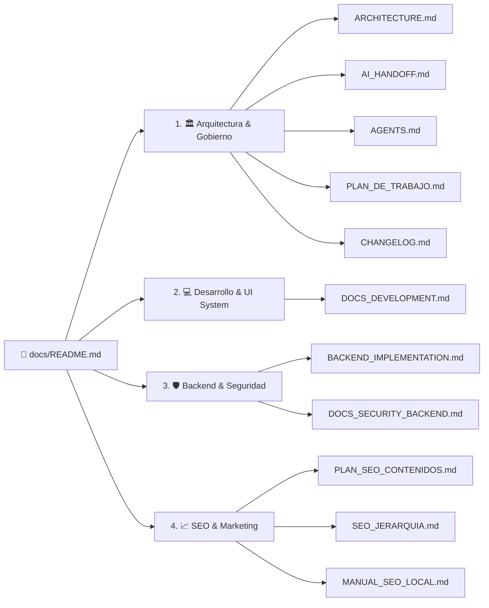

# 📚 Centro de Documentación Técnica — Portal GYA

Bienvenido al centro oficial de documentación de software de **Glass & Aluminum Company S.A.C.** (MyAppGlass). Este índice centraliza la arquitectura, guías de desarrollo, infraestructura serverless y estrategia de posicionamiento web del proyecto.

---

## 🧭 Mapa de Navegación por Dominio

---

## 📂 Catálogo Detallado de Documentos

### 1. 🏛️ Arquitectura & Gobierno del Código
Guías estructurales, patrones de diseño de software y protocolos de mantenimiento.

| Documento | Audiencia | Descripción |
| :--- | :--- | :--- |
| [**`ARCHITECTURE.md`**](./ARCHITECTURE.md) | Desarrolladores / Arquitectos | Estructura FSD (*Feature-Sliced Design*), flujo de datos O(1), diagramas ASCII y patrones de composición. |
| [**`AI_HANDOFF.md`**](./AI_HANDOFF.md) | Desarrolladores / Agentes IA | Convenciones de carpetas, alias de importación (`@/*`), reglas de código limpio y normas de identidad. |
| [**`AGENTS.md`**](./AGENTS.md) | Agentes IA / Tech Leads | Definición y responsabilidades de los 10 roles del equipo técnico (Aura Specialist, QA, Security, A11y, etc.). |
| [**`PLAN_DE_TRABAJO.md`**](./PLAN_DE_TRABAJO.md) | Project Managers / Todos | Roadmap multidisciplinario de 5 fases (Legal, CI/CD, Tipado Zod, Accesibilidad, Datos). |
| [**`CHANGELOG.md`**](./CHANGELOG.md) | Todos | Registro cronológico de versiones, migraciones arquitectónicas, optimizaciones y bug fixes. |

---

### 2. 💻 Desarrollo Frontend & Sistema de Diseño
Instrucciones operativas para configuración local, sistema Aura y rendimiento visual.

| Documento | Audiencia | Descripción |
| :--- | :--- | :--- |
| [**`DOCS_DEVELOPMENT.md`**](./DOCS_DEVELOPMENT.md) | Desarrolladores Frontend | Variables de entorno locales, tokens Fibonacci (`phi_xs` a `phi_xl`), aceleración GPU 120Hz y manejo de Skeletons. |

---

### 3. 🛡️ Backend, Cloud & Cumplimiento Legal
Microservicios serverless, persistencia legal INDECOPI y seguridad en la nube.

| Documento | Audiencia | Descripción |
| :--- | :--- | :--- |
| [**`BACKEND_IMPLEMENTATION.md`**](./BACKEND_IMPLEMENTATION.md) | Backend Engineers / DevOps | Firebase Functions v2, Resend SDK, persistencia en Firestore y flujo legal del Libro de Reclamaciones. |
| [**`DOCS_SECURITY_BACKEND.md`**](./DOCS_SECURITY_BACKEND.md) | DevOps / Security Officers | Google Cloud Run, gestión de secretos (Secret Manager), permisos públicos y auditoría de datos. |

---

### 4. 📈 SEO, Contenidos & Autoridad Web
Estrategia integral para posicionamiento en Google (Orgánico y Google Maps en La Molina).

| Documento | Audiencia | Descripción |
| :--- | :--- | :--- |
| [**`PLAN_SEO_CONTENIDOS.md`**](./PLAN_SEO_CONTENIDOS.md) | Content Strategists / SEOs | Calendario editorial, Topic Clusters (Ventanas Antirruido, Mamparas), arquitectura silo y esquemas JSON-LD. |
| [**`SEO_JERARQUIA.md`**](./SEO_JERARQUIA.md) | Frontend / SEOs | Diccionario exacto de etiquetas `<title>`, `<meta description>`, H1, H2 y H3 por cada página de la web. |
| [**`MANUAL_SEO_LOCAL.md`**](./MANUAL_SEO_LOCAL.md) | Marketing / Operaciones | Guía paso a paso para Google Business Profile, Google Search Console, canonical 301 y citas locales. |

---

## ⚡ Guía de Búsqueda Rápida (How-To)

- **¿Cómo levantar el entorno local completo?**  
  👉 Consulta [`DOCS_DEVELOPMENT.md`](./DOCS_DEVELOPMENT.md).
- **¿Cómo funciona el flujo legal del Libro de Reclamaciones?**  
  👉 Consulta [`BACKEND_IMPLEMENTATION.md`](./BACKEND_IMPLEMENTATION.md).
- **¿Qué tokens de espaciado y fuentes debo usar en la UI?**  
  👉 Consulta [`DOCS_DEVELOPMENT.md`](./DOCS_DEVELOPMENT.md) y [`ARCHITECTURE.md`](./ARCHITECTURE.md).
- **¿Dónde se agregan nuevos artículos para el blog?**  
  👉 Edita `src/features/blog/data/blog-posts.ts` y revisa [`PLAN_SEO_CONTENIDOS.md`](./PLAN_SEO_CONTENIDOS.md).
- **¿Cómo configurar Google Business Profile para La Molina?**  
  👉 Sigue la guía paso a paso en [`MANUAL_SEO_LOCAL.md`](./MANUAL_SEO_LOCAL.md).
