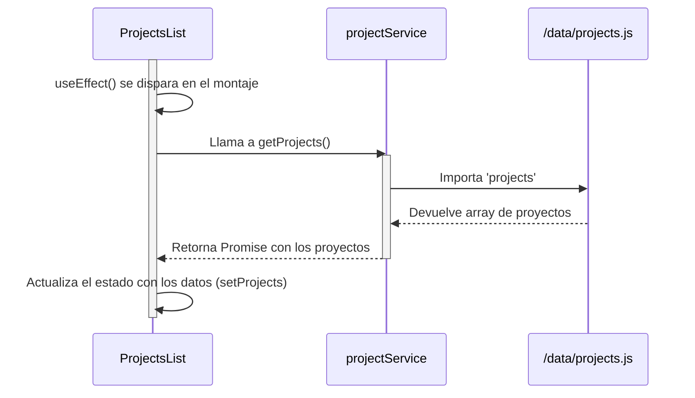

# Documento Técnico de Software: GYA Web App

Este documento proporciona una descripción técnica detallada de la arquitectura, el diseño y los componentes de la aplicación web de GYA Glass & Aluminum.

## 1. Introducción

El sistema es una aplicación web de página única (SPA) construida con React. Su propósito es servir como la presencia digital de la empresa, mostrando su portafolio de proyectos, detallando sus servicios y capturando prospectos de clientes a través de un formulario de contacto (Libro de Reclamaciones).

La arquitectura está diseñada para ser mantenible, escalable y performante, utilizando un stack tecnológico moderno y siguiendo las mejores prácticas de desarrollo de software.

## 2. Requerimientos

### 2.1. Requerimientos Funcionales

-   **RF-01:** El sistema debe mostrar una página de inicio con secciones de presentación, clientes, beneficios y acceso a la tienda.
-   **RF-02:** El sistema debe permitir a los usuarios ver una lista de todos los servicios ofrecidos.
-   **RF-03:** El sistema debe permitir a los usuarios ver una página de detalle para cada servicio, incluyendo una galería de imágenes y especificaciones técnicas.
-   **RF-04:** El sistema debe mostrar un portafolio de proyectos completados.
-   **RF-05:** El sistema debe proporcionar un formulario (Libro de Reclamaciones) para que los usuarios envíen sus datos de contacto y solicitudes.
-   **RF-06:** La información enviada a través del formulario debe ser procesada y enviada a un destinatario de la empresa por correo electrónico.
-   **RF-07:** El sistema debe ser navegable a través de una barra de navegación principal persistente.

### 2.2. Requerimientos No Funcionales

-   **RNF-01:** La aplicación debe ser completamente responsiva y funcional en dispositivos móviles, tabletas y de escritorio.
-   **RNF-02:** Los tiempos de carga iniciales deben ser optimizados. Las páginas y sus datos deben cargarse de forma asíncrona para no bloquear el hilo principal.
-   **RNF-03:** El código debe ser legible, mantenible y estar documentado internamente (JSDoc).
-   **RNF-04:** El diseño visual debe ser consistente en toda la aplicación, utilizando un sistema de diseño centralizado.
-   **RNF-05:** La aplicación debe ser desplegable de forma automatizada.
-   **RNF-06:** El contenido principal del sitio (proyectos, servicios) debe estar desacoplado de la lógica de la UI para facilitar futuras actualizaciones.

## 3. Arquitectura y Diseño

El sistema sigue una arquitectura de capas, separando la presentación, la lógica de negocio y el acceso a datos.

```mermaid
graph TD
    A[Usuario] --> B{Browser};
    B --> C[Capa de Presentación (React)];
    C --> D[Capa de Servicios];
    D --> E[Capa de Datos (Archivos JS)];
    D -.-> F[Futuro: Headless CMS];

    subgraph "Frontend (Vite SPA)"
        C
        D
        E
    end

    G[Función Serverless (Firebase)]
    C --> G;
    G --> H[API Externa (Resend)];

    style C fill:#d2f9d2
    style D fill:#f9d2d2
    style E fill:#f9f3d2
```

-   **Capa de Presentación (UI):** Construida con componentes de React y Chakra UI. Es responsable de renderizar la interfaz y capturar las interacciones del usuario. No contiene lógica de negocio directa.
-   **Capa de Servicios (`src/services`):** Abstrae el origen de los datos. Los componentes de la UI solicitan datos a esta capa. Actualmente, esta capa resuelve los datos desde archivos estáticos, pero está diseñada para apuntar a una API externa en el futuro con un mínimo refactor.
-   **Capa de Datos (`src/data`):** Archivos JavaScript estáticos que actúan como una base de datos provisional.
-   **Funciones Serverless:** Para funcionalidades dinámicas como el envío de correos, la UI se comunica con una función serverless desplegada en Firebase, que a su vez utiliza servicios de terceros (como Resend).

### 3.1. Flujo de Datos Asíncrono

El siguiente diagrama ilustra cómo un componente de lista (ej. `ProjectsList`) carga sus datos.



### 3.2. Composición de Componentes

Las páginas se construyen siguiendo un patrón de composición, donde los contenedores se encargan de la lógica y el estado, y los componentes de presentación se encargan de la UI.

**Ejemplo: Página de Detalle de Servicio**

```mermaid
graph TD
    R[Ruta: /servicios/:serviceSlug] --> A[ServicePageContainer];
    A -->|1. Obtiene 'serviceSlug'| A;
    A -->|2. Llama a getServicePageData(slug)| S(serviceService);
    S --> D{servicePageDataMap};
    D --> S;
    S --> A;
    A -->|3. Pasa 'pageData' como prop| B[ServicePageLayout];
    B --> C[ServiceSidebar];
    B --> E[Gallery];

    subgraph "Contenedor (Lógica)"
        A
    end
    subgraph "Componentes de Presentación (UI)"
        B
        C
        E
    end
```

## 4. API y Puntos de Integración

### 4.1. `reclamoService`

-   **Propósito:** Enviar los datos del formulario del libro de reclamaciones a una función serverless.
-   **Endpoint:** La URL de la función se obtiene de la variable de entorno `VITE_API_URL`.
-   **Función:** `submitReclamo(reclamoData)`
    -   **Método:** `POST`
    -   **Cuerpo:** `reclamoData` (objeto JSON con todos los campos del formulario).
    -   **Respuesta Exitosa:** Devuelve un objeto `{ success: true, data: { id: '...' } }` donde `id` es el ID de seguimiento del correo enviado.
    -   **Respuesta de Error:** Lanza un error con un mensaje descriptivo.

## 5. Riesgos y Mitigaciones

-   **Riesgo:** El contenido del sitio sigue estando en el repositorio de código, aunque en una capa de datos separada.
-   **Mitigación:** La arquitectura actual con una capa de servicios es el primer paso crucial. La migración a un Headless CMS ahora solo requeriría modificar las funciones en la capa de servicios, sin necesidad de tocar la capa de presentación. Esto reduce drásticamente el costo y la complejidad de la futura migración.
